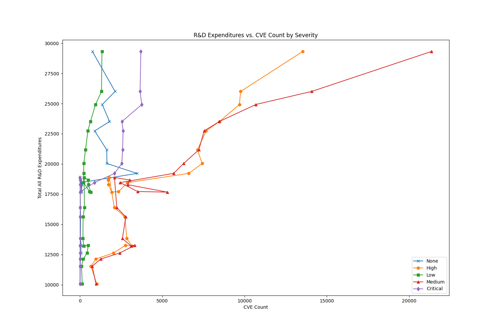
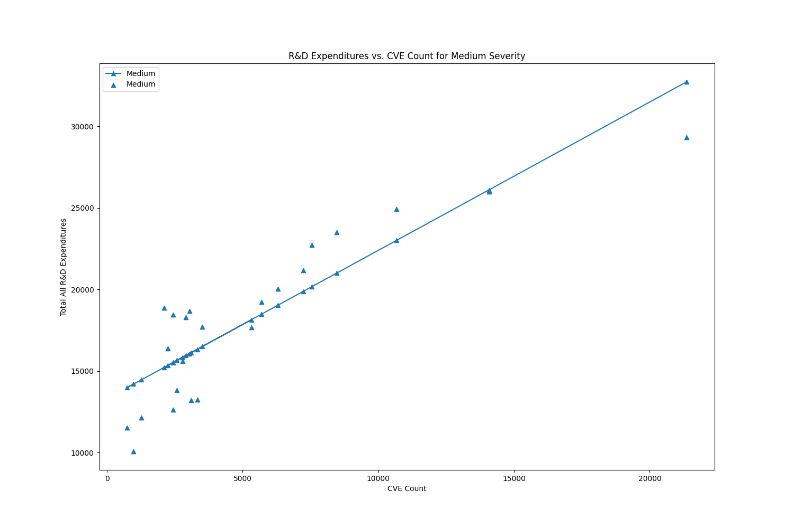
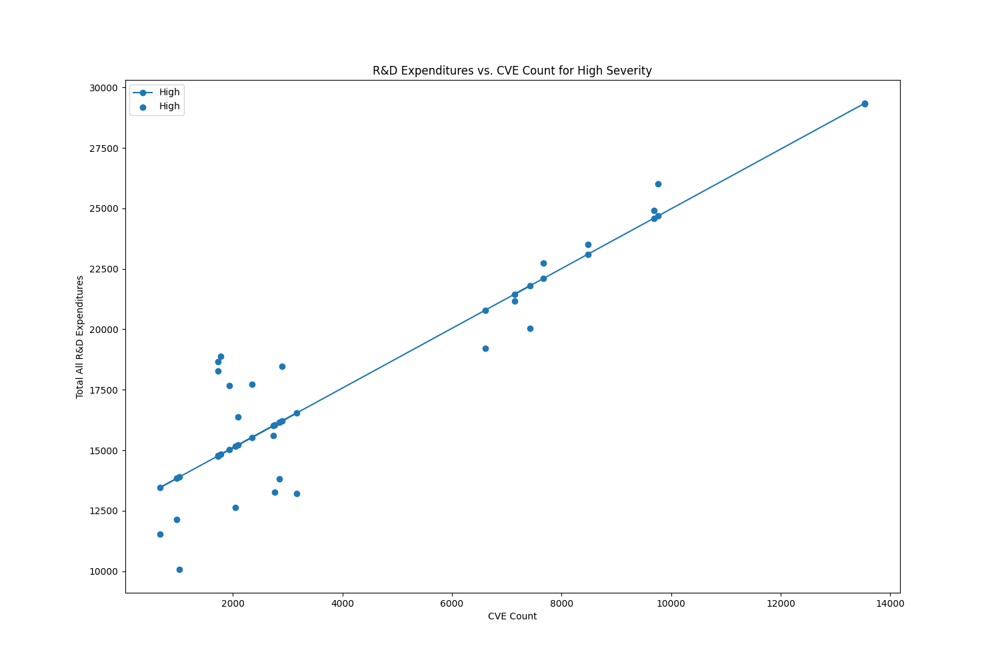
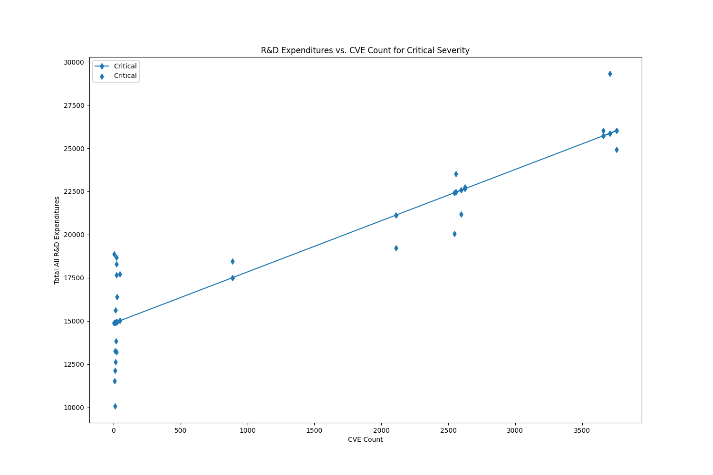

# Analysis of Cybersecurity Vulnerabilities Severity Levels Against R&D Expenditures 

## Contributors

- Monica Ramos

## Summary 

Cybersecurity Vulnerabilities have been present within our digital systems for a long period of time and they don’t stop being produced. Across Vulnerabilities we have different types of severity levels which are essential to track because depending on severity level, users will need to react on a more urgent basis. This analysis will be focused on comparing the severity levels found within the National Institute of Science and Technology (NIST) National Vulnerability Dataset (NVD) and with R&D expenditures at Federally Funded Research and Development Center (FFRDC) over a period. This assessment is primarily through the years 2002 and 2024 as the National Center for Science and Engineering Statistics (NCSES) within the National Science Foundation (NSF) has made tables with the expenditures from fiscal years 2001-2024. The NVD has years going from 2026 until 2002 which shaped the years of analysis to 2002-2024. The primary objective will be to determine if reported vulnerability severity levels correspond to increases in national R&D expenditures and if so, what level showcases the highest correlation. While these R&D expenditures are not specific to cybersecurity, we can use the overall investments in science and technology to see a general trend, if any. By examining these two datasets, this project will explore the broader research activity at a federal level and its association with the growth of vulnerabilities. 

The motivation for this project stems from the ever-changing landscape of digital technology and the complexities of online safety. With the rise of these cybersecurity incidents, we need to match the growing pace of these technologies and tackle them head on. As federal agencies seek to push out these emerging technologies, there will be more cracks within them where we will see vulnerabilities seep in. With an increase in R&D investments, there maybe an enhancement within the capabilities to analyze and report vulnerabilities. Therefore, understanding whether the correlation from these two exists and moves together provides valuable insight into priorities of national research into cybersecurity risk. 

The project uses three datasets: (1) the National Vulnerability Dataset, filtered and extracted to include all CVEs from 2002-2024 with their assigned CVSS severity levels; (2) NSF’s “R&D expenditures at federally funded research and development centers, by source of funds: FYs 2001–24”; and (3) NSF’s “Total and federally financed R&D expenditures at federally funded research and development centers, by type of R&D: FYs 2001–24.” Severity counts were aggregated annually for each severity level (None, Low, Medium, High, Critical), and these counts were compared to the annual R&D expenditures using linear regression and correlation analysis.

Preliminary findings indicate a consistent upward trend in both R&D expenditures and the number of medium, high, and critical vulnerabilities reported within the NVD. This regression model showcases R^2 of above the 0.7 significance threshold and for all three of these models, higher than .74. All p-values across all five models displayed a p-value that is significantly less than the 0.05 threshold demonstrating the strong correlation between the variables. Severity for none showed the least amount of correlation with the R^2 value at 0.335 sitting at a marginally weak relationship. The p-value is 0.004 which hits the 0.05 significance threshold, which shows that the relationship is statistically significant but it is weak relation based off of further analysis of its variation. This is further demonstrated with visualizations and best fit lines. 

Overall, the project exhibits cybersecurity vulnerability data alongside federal research expenditure data to provide a meaningful lens in understanding long-term cybersecurity trends. The analysis brings forward key findings to help ongoing discussions about cybersecurity risk and future work to explore more specific domains in need. 

## Data Profile

The first dataset used in this project is the National Vulnerability Dataset from [NIST](https://nvd.nist.gov/vuln/data-feeds). This data is provided as a public service by the NIST which is provided as U.S. Government work, so the data falls under the public domain. NVD does not discover vulnerabilities but instead they are synchronized with the Common Vulnerabilities and Exposures (CVE) list which is then managed by MITRE Corporation. The NVD maintains an up-to-date CVE list by processing the list every hour to see new CVE publications, rejections, or modifications. The NVD will only keep CVEs that have been published under the Official CVE List. The NVD then published their own JSON feeds that are enhanced with more structured metadata for public use. The datasets can be found within zip files that once extracted, give users a JSON file. Atop the JSON 2.0 Feeds, there is a Schema that users may use to break down the records. This dataset provides the severity levels needed to assess the cybersecurity vulnerabilities in the report.

This project then uses two complementary datasets from the [National Science Foundation’s FFRDC](https://ncses.nsf.gov/surveys/ffrdc-research-development/2024#data-tables) Research and Development Survey. These datasets provide annual R&D expenditure totals from Fiscal Years 2001-2024. This coverage aligns with the NVD dataset enabling year-to-year comparison or overall trend growth. The first table is R&D expenditures at all U.S. FFRDC's separated by funding source. The second table is grouped further by type so they separate the federally financed sector and then within that separate into all R&D, basic research, applied research, and experimental development by amount in millions and percentages. The NSD is a U.S. federal agency and their tables are U.S. Government works which put the data within the public domain. Therefore this data is publicly available and contains no sensitive information. 

## Data Quality

### Accuracy 

The NVD data comes with its own JSON schema to follow so this allows for the data to validated as the schema will enforce the required fields and correct data types, formats, patterns, etc. This will ensure that the data is more likely to be syntactically correct. With this and alongside the feeds being machine-generated, there is less of a probable chance for syntactic errors. The NVD runs there own schema validation prior to publishing which ensures this data to be high-confidence. Semantic errors are more challenging with this dataset because there could be misclassifications, an update to a vendor, a score needs recalculation, but to compensate for this, the ‘lastModified’ column is important.

For the R&D tables, these have are high-confidence because they are all strictly numeric except for the fiscal year column. The tables undergo automated validation so no malformed rows or mixed types. These tables have high syntactic accuracy. For Semantic accuracy, the risk is low but higher compared to syntactic. The semantic accuracy is still high because there is constant cross checks of the data and revisions are published so there is transparency. There could be semantic errors with aggregation effects or revisions so there are more so interpretable limits. 

### Consistency

For consistency, the NVD dataset is primarily consistent with their overall structure but the main fault is within their Severity fields. Severity type could be found in different columns under different names. This is solved for in the fetch_data.py file. The NSF R&D dataset files are very consistent structurally and have temporal consistency. Overall very consistent and reliable foundation for our temporal analysis. 

### Timeliness

The NVD dataset is updated continuously every hour, the NVD checks for new CVEs. There is a slight delay between publications but overall very frequent. Since this project’s analysis focused on annual severity counts, the short-term publications would not affect the results. The NSF R&D Dataset publishes once per year and there is the 6 -12 month lag because of this. Therefore we do not necessarily have access to 2026 data yet but 2024 is still a stable year top end range. These datasets allow for longitudinal analysis. 

## Data Cleaning

The NVD JSON feeds had the vulnerability information embedded in nested objects so this needed to be extracted. The JSON schema contains dozens of fields but for this analysis, only the following fields needed to be kept: ID, PubDate, Status, ModDate, and Severity. Severity tended to be across multiple different columns but these fields were selected to reduce noise. There was temporal fitting issues as for the NVD records, the year 2002, contains vulnerabilities found prior to 2002 so those records were dropped from the database and records from past 2024 were also dropped. This was to maintain consistent alignment with NSF R&D datasets spanning from 2001-2024. The NSF R&D then had row 2001 dropped to maintain the consistency. The R&D dataset needed header reformatting. The data then was merged into a combined_data.py file for analysis. 

## Findings

In the above graph we see a strong upward trend for Critical CVEs (red line) and this showcases the positive correlation that as critical CVEs increase, total R&D expenditures also increases. All other levels are flatter. Critical vulnerabilities does scale when it comes to national R&D spending. As investment into R&D grows, there are more complex systems which increase the severity of vulnerabilities. There is more at stack when it comes to these vulnerabilities making them critical. This does not prove causation, does not mean R&D is harmful, and does not mean that the other severities are uncorrelated. This is showing the relationship is correlational and aligns with this projects research goal. 

Throughout these graphs, there is a strong upward smooth line showcasing the clear positive relationships these vulnerabilities have with total R&D expenditures. They all showcase positive linear relationships reinforcing the research goal of correlation. Some best fit lines are steeper because they are have a weaker relationship but this proves their statistical significance. 

## Future Work

Therefore for future work, a causal inference would be helpful in establishing instrumental variables to test for that causal relationship. Since this project focused heavily on correlational relationships. This project also worked solely on R&D data which is U.S. only whereas the NVD is a global dataset and could apply to other countries. This could further evaluate trends across different economic markets. This would then determine if the relationship is structural or only U.S. specific. 

## Challenges

One of the biggest gaps present is the lack of other cybersecurity vulnerability datasets. Most vulnerability datasets published, pull from the NVD so there isn’t much viable comparison. There was also a huge lack in columns selected for this project, more columns could’ve been used for a bigger analysis on questions aside from temporal growth. The R&D expenditures also had a general increase throughout each fiscal year so that could’ve interfered with the data. There is also the issue of whether or not more vulnerabilities exist or whether or not we have better equipment now to find them. 

## Reproducing

To be able to produce the same results run snakemake -c 1 --delete-all-output to remove all existing files and then run snakemake -c 1 to run all scripts in the project.

## References

National Institute of Standards and Technology. (2025, August 20). NVD Data Feeds. National Vulnerability Database. https://nvd.nist.gov/vuln/data-feeds

National Institute of Standards and Technology. (2022, September 20). General FAQs. National Vulnerability Database. https://nvd.nist.gov/general/FAQ-Sections/General-FAQs 

National Science Foundation. FFRDC Research and Development Survey: R&D Expenditures at Federally Funded Research and Development Centers, FY 2001–2024. National Center for Science and Engineering Statistics (NCSES). https://ncses.nsf.gov/surveys/ffrdc-research-development/2024#data 

